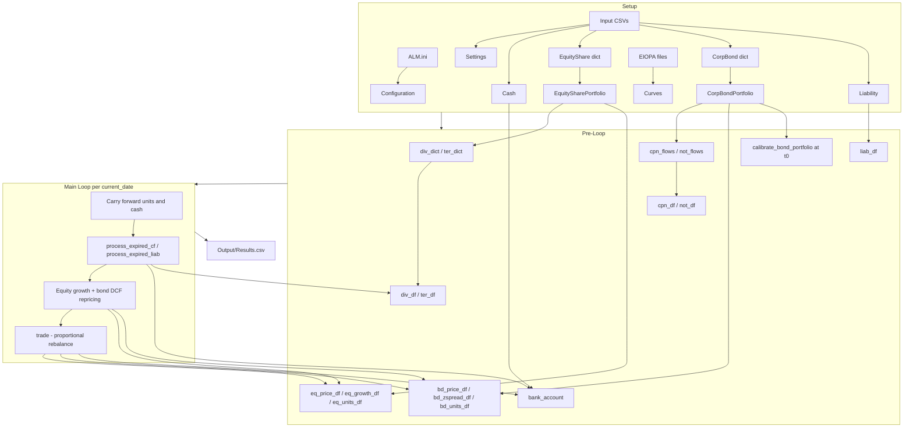

# OSEM Agent Instructions

Instructions for AI coding agents working on the **Open-Source Economic Model (OSEM)** — an asset-liability management (ALM) proof-of-concept for life insurers and pension funds.

## Project purpose

OSEM simulates, on an annual discrete timeline:

1. Evolution and performance of investments (equities, corporate bonds, cash)
2. Liability cash outflows
3. Proportional rebalancing to absorb liquidity surpluses and deficits

The entry point is `main.py`. Configuration comes from `ALM.ini` and CSV files under `Input/`. Results are written to `Output/Results.csv`.

## Architecture

### Two-layer design

| Layer | Contents | Mutated during the main loop? |
|-------|----------|-------------------------------|
| Static dataclasses | `EquityShare`, `CorpBond`, `Cash`, `Liability` — loaded once from CSV | No |
| pandas DataFrames | Prices, units, spreads, bank account, cash-flow matrices, summary | Yes |

Individual `EquityShare` / `CorpBond` instances hold metadata and pricing logic. All simulation state evolves in DataFrames. Do not write back to dataclass instances after import.

Portfolio wrappers (`EquitySharePortfolio`, `CorpBondPortfolio`) are also static after setup.

### Dataflow



### Key files

| File | Role |
|------|------|
| `main.py` | Orchestration: setup, pre-loop, annual loop, output |
| `MainLoop.py` | Cash-flow matrices, date schedules, expiry processing, trading |
| `CurvesClass.py` | EIOPA Smith-Wilson term structure (calibration, projection, discounting) |
| `EquityClasses.py` | Equity pricing, cash flows, portfolio wrapper |
| `BondClasses.py` | Bond pricing, z-spread calibration, portfolio wrapper |
| `LiabilityClasses.py` | Aggregated liability cash-flow profile |
| `ImportData.py` | Load `ALM.ini`, CSV inputs, EIOPA curve files |
| `ConfigurationClass.py` / `SettingsClasses.py` | Config and run parameters |
| `CashClass.py` | Initial cash balance |
| `ALM.ini` | Paths, logging, trace flags, input file names |
| `Input/` | Portfolio CSVs, parameters, curves, liabilities |
| `unit_tests/` | pytest suite — update when changing public behaviour |

## Methodology principles

### Interest rates

- Risk-free curve loaded from EIOPA files via `import_SWEiopa`
- `Curves` calibrates Smith-Wilson (`SetObservedTermStructure` → `CalcFwdRates` → `ProjectForwardRate` → `CalibrateProjected`)
- After setup, `curves` is read-only in the main loop; asset pricing calls `RetrieveRates(proj_period, maturities, "Discount", spread)`

### Assets

- **Equities:** deterministic growth each period using the fixed `eq_growth_df[modelling_date]` column; not re-priced via DCF in the loop
- **Bonds:** DCF repricing each period via `price_bond_portfolio`; z-spread calibrated once at t0 via `calibrate_bond_portfolio` (stored in `bd_zspread_df`, not on `CorpBond` instances)

### Liabilities

- **Current POC:** precomputed absolute cash flows from `Input/Liability_Cashflow.csv` (single aggregated row)
- **Planned, not yet in main loop:** mortality/lapse from `mortality.csv` via `SocietyClass` (path configured in `ALM.ini` as `input_mortality`)

### Trading

- `trade()` in `MainLoop.py` proportionally buys or sells equities and bonds to drive `bank_account` toward zero

### Main loop steps (per `current_date`)

1. Carry forward `eq_units_df`, `bd_units_df`, `bank_account` from `previous_date`
2. Expire asset cash flows (`process_expired_cf`) and liabilities (`process_expired_liab`); credit/debit `bank_account`; drop expired columns from cf DataFrames
3. Mark-to-market: equity growth, bond DCF repricing
4. Proportional `trade()`
5. Log period-end cash and market value to `summary_df`; advance `proj_period`

## Coding conventions

### Type hints and arrays

- Pass **NumPy arrays** to curve/term-structure APIs. Convert pandas at the call site:

  ```python
  curves.SetObservedTermStructure(
      maturity_vec=curve_country.index.to_numpy(dtype=float),
      yield_vec=curve_country.to_numpy(dtype=float),
  )
  ```

- Do not pass a bare pandas `Index` or `Series` to `pd.DataFrame(data=...)` inside curve methods — pandas treats them as column labels, not row data.

### State mutation

- Update DataFrames in the loop; never mutate `EquityShare` / `CorpBond` instances after CSV import
- `process_expired_cf` / `process_expired_liab` return updated DataFrames and date lists — callers must reassign (`div_df`, `unique_div_dates`, etc.)
- Expired cash-flow columns must be dropped via assignment (`cash_flows = cash_flows.drop(...)`) to avoid double-counting

### Docstrings

- Every function: short description, then `Parameters` and `Returns` sections
- Align with the intent in `llm_modelfile/modelfile.txt`

### General

- Prefer minimal, focused diffs; match existing naming and patterns
- Update `unit_tests/` when changing public behaviour
- Do not commit secrets or machine-specific paths

## Inputs and outputs

| Item | Source |
|------|--------|
| Configuration | `ALM.ini` → `Configuration` |
| Run parameters | `Input/Parameters.csv` → `Settings` |
| Portfolios | `Input/*_Portfolio_test.csv` |
| EIOPA curves | paths in `Settings` |
| Liabilities | `Input/Liability_Cashflow.csv` |
| Output | `Output/Results.csv` (`summary_df`) |

## Deeper documentation

Do not duplicate full methodology here. Refer to:

- `Documentation/OSEM_Documentation_draft.pdf` — methodology draft
- `Documentation/OSEM_Documentation_draft.ipynb` — same content as notebook
- `Documentation/Archive/` — yield-curve, equity, and bond pricing prototypes
- `*_PROTOTYPE*.ipynb` — topic-specific deep dives at repo root and in `Liability_Dev/`

## Maintenance

When architecture, conventions, or planned features change, update this file in the same PR as the code change.
