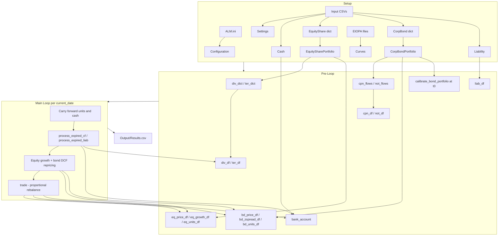

# OSEM Agent Instructions

Instructions for AI coding agents working on the **Open-Source Economic Model (OSEM)** — an asset-liability management (ALM) proof-of-concept for life insurers and pension funds.

## Project purpose

OSEM simulates, on an annual discrete timeline:

1. Evolution and performance of investments (equities, corporate bonds, cash)
2. Liability cash outflows
3. Proportional rebalancing to absorb liquidity surpluses and deficits

The entry point is `main.py`. Configuration comes from `ALM.ini` and CSV files under `Input/`. Results are written to `Output/Results.csv`.

## Architecture

### Two-layer design

| Layer | Contents | Mutated during the main loop? |
|-------|----------|-------------------------------|
| Static dataclasses | `EquityShare`, `CorpBond`, `Cash`, `Liability` — loaded once from CSV | No |
| pandas DataFrames | Prices, units, spreads, bank account, cash-flow matrices, summary | Yes |

Individual `EquityShare` / `CorpBond` instances hold metadata and pricing logic. All simulation state evolves in DataFrames. Do not write back to dataclass instances after import.

Portfolio wrappers (`EquitySharePortfolio`, `CorpBondPortfolio`) are also static after setup.

### Dataflow



### Key files

| File | Role |
|------|------|
| `main.py` | Orchestration: setup, pre-loop, annual loop, output |
| `MainLoop.py` | Cash-flow matrices, date schedules, expiry processing, portfolio valuation, trading |
| `CurvesClass.py` | EIOPA Smith-Wilson term structure (calibration, projection, discounting) |
| `EquityClasses.py` | Equity pricing, cash flows, portfolio wrapper |
| `BondClasses.py` | Bond pricing, z-spread calibration, portfolio wrapper |
| `LiabilityClasses.py` | Aggregated liability cash-flow profile |
| `ImportData.py` | Load `ALM.ini`, CSV inputs, EIOPA curve files |
| `ConfigurationClass.py` / `SettingsClasses.py` | Config and run parameters |
| `CashClass.py` | Initial cash balance |
| `TraceClass.py` | Optional call tracing (`tracer`); enabled via `ALM.ini` `[TRACE]` |
| `FrequencyClass.py` | Dividend/coupon frequency enums used by equity and bond classes |
| `ALM.ini` | Paths, logging, trace flags, intermediate output, input file names |
| `Input/` | Portfolio CSVs, parameters, curves, liabilities |
| `unit_tests/` | pytest suite — update when changing public behaviour |

**Stub / not wired into `main.py` yet:**

| File | Role |
|------|------|
| `SocietyClass.py` | Mortality/lapse stub — `input_mortality` is configured but not loaded in the main loop |
| `PropertyClasses.py` | Real-estate asset prototype; not used in the POC run |
| `ExportData.py` | CSV export helper; not used in the POC run |
| `PathsClasses.py` | Path helper for tests only |

### `ALM.ini` sections

| Section | Maps to |
|---------|---------|
| `[TRACE]` | `Configuration.trace_enabled` → `tracer.enabled` in `main.py` |
| `[LOGGING]` | `logging_level`, `logging_file_name` |
| `[INTERMEDIATE]` | Optional intermediate CSV output paths (`intermediate_enabled`, `intermediate_path`) |
| `[INPUT]` | Input/output folder paths and file names (`input_*`, `output_path`) |
| `[BASE]` (optional) | Override `base_folder`; defaults to current working directory |

Note: `Configuration` also stores paths for `input_curves`, `input_param_no_VA`, and `input_spread`, but the main run loads EIOPA files via paths in `Settings` (`Parameters.csv`), not those `Configuration` fields directly.

## Methodology principles

### Interest rates

- Risk-free curve loaded from EIOPA files via `import_SWEiopa` (paths from `Input/Parameters.csv`: `EIOPA_param_file`, `EIOPA_curves_file`)
- `Curves` calibrates Smith-Wilson (`SetObservedTermStructure` → `CalcFwdRates` → `ProjectForwardRate` → `CalibrateProjected`)
- After setup, `curves` is read-only in the main loop; asset pricing calls `RetrieveRates(proj_period, maturities, "Discount", spread)`

### Assets

- **Equities:** deterministic growth each period using the fixed per-asset `eq_growth_df[modelling_date]` column; not re-priced via DCF in the loop. Growth is scaled by `time_frac = (current_date - previous_date).days / 365.25`
- **Bonds:** carry forward `bd_price_df[previous_date]` into the new column, then DCF repricing each period via `price_bond_portfolio`; z-spread calibrated once at t0 via `calibrate_bond_portfolio` (stored in `bd_zspread_df`, not on `CorpBond` instances)

### Liabilities

- **Current POC:** precomputed absolute cash flows from `Input/Liability_Cashflow.csv` (single aggregated row)
- **Planned, not yet in main loop:** mortality/lapse from `Input/mortality.csv` via `SocietyClass` (path configured in `ALM.ini` as `mortality` → `Configuration.input_mortality`)

### Trading

- `trade()` in `MainLoop.py` proportionally buys or sells equities and bonds to drive `bank_account` toward zero
- Use `portfolio_market_value()` for combined equity + bond market value at a date. It is used inside `trade()`; `main.py` still has inline `sum(...)` expressions that should be refactored to call this helper — do not add new inline sums in `main.py` or `trade()`

### Main loop helpers (`MainLoop.py`)

| Function | Role |
|----------|------|
| `create_cashflow_dataframe(cf_dict, unique_dates)` | Build per-asset cash-flow matrix (rows = asset_id, columns = dates) |
| `create_liabilities_df(liabilities)` | Build liability cash-flow DataFrame from `Liability` |
| `set_dates_of_interest(modelling_date, end_date)` | Annual projection date schedule |
| `portfolio_market_value(eq_price, eq_units, bd_price, bd_units, as_of)` | Total invested assets MV at a date column; used in `trade()`; should also be used in `main.py` summary metrics |
| `process_expired_cf` / `process_expired_liab` | Expire cash flows, return cash amount and shrunk DataFrames |
| `calculate_expired_dates` | Internal helper: dates on or before the deadline |
| `trade` | Proportional buy/sell to balance `bank_account` toward zero |

### Main loop steps (per `current_date`)

1. Carry forward `eq_units_df`, `bd_units_df`, `bank_account` from `previous_date`; record start cash and start market value
2. Expire cash flows in sequence, crediting/debiting `bank_account` and logging each to `summary_df`:
   - Dividends (`div_df`), coupons (`cpn_df`), equity terminal (`ter_df`), bond notional (`not_df`) via `process_expired_cf`
   - Liabilities (`liab_df`) via `process_expired_liab` (debited from `bank_account`)
3. Mark-to-market: apply equity growth using `eq_growth_df[modelling_date]` and `time_frac`; carry bond prices forward then reprice via `price_bond_portfolio`; record after-growth MV and portfolio return
4. Proportional `trade()`
5. Log period-end cash and end market value to `summary_df`; set `previous_date = current_date`; advance `proj_period`

## Coding conventions

Follow these patterns when adding or changing code. Prefer the style in `MainLoop.py` and `SettingsClasses.py` over older modules (`CurvesClass`, `EquityClasses`) where they differ.

### Portfolio and asset structure

- Build portfolios as `dict[int, Asset]` keyed by `asset_id`, then pass to a portfolio wrapper:

  ```python
  eq_input = {equity_share.asset_id: equity_share for equity_share in get_EquityShare(filename)}
  eq_ptf = EquitySharePortfolio(eq_input)
  ```

- Portfolio wrappers expose a consistent API:

  | Method | Purpose |
  |--------|---------|
  | `IsEmpty()` / `add()` | Portfolio management |
  | `create_*_flows()` | Per-asset cash-flow dicts |
  | `unique_dates_profile()` | Unique payment dates |
  | `init_*_portfolio_to_dataframe()` | Initial price / units / (growth or z-spread) matrices |

- Mirror this shape when adding a new asset class: dataclass for the instrument, portfolio wrapper for aggregation, `get_*` loader in `ImportData.py`.

### Cash-flow pipeline

Standard flow:

```
instrument.create_single_cash_flows()
  → portfolio.create_*_flows()     # Dict[int, Dict[date, float]]
  → create_cashflow_dataframe()    # rows = asset_id, columns = dates
  → process_expired_cf() in loop   # per-unit flows × units
```

- **Assets:** cash flows are **per unit**; expiry multiplies by `units[expiration_date]`.
- **Liabilities:** cash flows are **absolute amounts**; `process_expired_liab` sums columns directly (no units).

### DataFrame layout

| DataFrame | Index | Columns |
|-----------|-------|---------|
| `eq_price_df`, `eq_units_df`, `bd_price_df`, `bd_units_df`, `bd_zspread_df` | `asset_id` | modelling dates |
| `div_df`, `cpn_df`, `ter_df`, `not_df` | `asset_id` | cash-flow dates |
| `bank_account` | single row (`loc[0, date]`) | modelling dates |
| `liab_df` | `liability_id` | liability payment dates |

When adding a new date column in the loop, carry forward from `previous_date`, then update in place for `current_date`.

### CSV import (`ImportData.py`)

- Single-object loaders: `get_configuration()`, `get_settings()`, `get_Cash()`, `get_Liability()`.
- Row iterators: `get_EquityShare()`, `get_corporate_bonds()` → `Iterator` (one instance per CSV row).
- Use `encoding="utf-8-sig"`, `csv.DictReader`, dates as `'%d/%m/%Y'`.
- CSV column names are `Pascal_Case` (`Asset_ID`, `Market_Price`, etc.).
- Do not read CSVs inline in `main.py` — add a `get_*` function in `ImportData.py`.

### Configuration split

| Source | Class | Contents |
|--------|-------|----------|
| `ALM.ini` | `Configuration` (plain class) | File paths, logging, trace, intermediate output |
| `Input/Parameters.csv` | `Settings` (`@dataclass`) | Run parameters; `end_date` computed in `__post_init__` |

### Dates and time

- Modelling timeline: `set_dates_of_interest()` steps in 365-day increments.
- Year fractions: use `days / 365.25` in the main loop and DCF discounting (some older equity helpers use `365.5` — prefer `365.25` for new code).
- Payment schedules: `relativedelta(months=(12 // frequency))` from `issue_date`, skipping dates before `modelling_date`.
- `Frequency` is an `IntEnum` (`MONTHLY=12`, `QUARTERLY=4`, etc.) stored as int in CSV.

### Pricing and curves

- Curve setup once in `main.py`; `curves` is read-only in the loop.
- Pricing calls `RetrieveRates(proj_period, maturities_numpy, "Discount", spread)`.
- **Equity spreads:** `spread_country + spread_sector + spread_stress`.
- **Bond spreads:** z-spread calibrated once at t0 via bisection into `bd_zspread_df`, then read from the DataFrame during repricing (not from `CorpBond.zspread` in the loop).

### Main-loop orchestration

- `main.py` is procedural and logging-heavy: each major step gets a `logger.info(...)` call.
- Loop logic lives in `MainLoop.py` as **module-level functions** that return updated state — callers must **reassign**:

  ```python
  cash, div_df, unique_div_dates = process_expired_cf(...)
  ```

- Use `portfolio_market_value()` for combined MV; do not add new inline `sum(...)` in `main.py` or `trade()`.

### Class and file naming

| Pattern | Example |
|---------|---------|
| `*Class.py` files | `EquityClasses.py`, `BondClasses.py` |
| Asset dataclass | `EquityShare`, `CorpBond` |
| Portfolio wrapper | `EquitySharePortfolio`, `CorpBondPortfolio` |
| Loop / orchestration | `MainLoop.py`, `main.py` |
| Import loaders | `get_EquityShare`, `import_SWEiopa` |

Method naming is mixed (`IsEmpty` is PascalCase; most others are `snake_case`). Match the surrounding class.

### Type hints and arrays

- Pass **NumPy arrays** to curve/term-structure APIs. Convert pandas at the call site:

  ```python
  curves.SetObservedTermStructure(
      maturity_vec=curve_country.index.to_numpy(dtype=float),
      yield_vec=curve_country.to_numpy(dtype=float),
  )
  ```

- Do not pass a bare pandas `Index` or `Series` to `pd.DataFrame(data=...)` inside curve methods — pandas treats them as column labels, not row data.

### State mutation

- Update DataFrames in the loop; never mutate `EquityShare` / `CorpBond` instances after CSV import.
- `process_expired_cf` / `process_expired_liab` return updated DataFrames and date lists — callers must reassign (`div_df`, `unique_div_dates`, etc.).
- Expired cash-flow columns must be dropped via assignment (`cash_flows = cash_flows.drop(...)`) to avoid double-counting.

### Docstrings and logging

- Every function: short description, then `Parameters` and `Returns` sections.
- Use the hybrid Sphinx style already in the codebase (`:type param: type` under `Parameters`).
- Align with the intent in `Archive/llm_modelfile/modelfile.txt`.
- Many modules set up a module-level `logger` with a dedicated log file (e.g. `EquityClasses.log`, `BondClass.log`, `ALM.log`).

### Validation and immutability

- `CorpBond` is `@dataclass(frozen=True)` with range checks in `__post_init__`.
- `EquityShare` is a mutable `@dataclass` with lighter validation.
- New bond-like instruments should follow the stricter `CorpBond` pattern.

### Testing

- **pytest** with `@pytest.fixture` for instruments, curves, portfolios.
- Tests named `test_<behaviour>`; fixtures build objects inline with realistic dates and `Frequency` enums.
- Update `unit_tests/` when changing public behaviour.

### Checklist for new code

1. Dataclass + portfolio wrapper for a new asset type.
2. `get_*` loader in `ImportData.py`.
3. `Dict[int, Dict[date, float]]` cash flows → matrix via `create_cashflow_dataframe`.
4. Simulation state in DataFrames (rows = `asset_id`, columns = dates).
5. Loop steps as `MainLoop.py` functions returning updated tuples.
6. NumPy arrays into `Curves` APIs.
7. `logger.info(...)` for major steps in `main.py`.
8. pytest coverage for the new public API.
9. Prefer minimal, focused diffs; do not commit secrets or machine-specific paths.

## Inputs and outputs

| Item | Source |
|------|--------|
| Configuration | `ALM.ini` → `Configuration` |
| Run parameters | `Input/Parameters.csv` → `Settings` |
| Portfolios | `Input/Cash_Portfolio.csv`, `Input/Equity_Portfolio.csv`, `Input/Bond_Portfolio.csv` |
| EIOPA curves | `Input/Param_no_VA.csv`, `Input/Curves_no_VA.csv` (paths in `Settings`) |
| Sector spreads | `Input/Sector_Spread.csv` (configured in `ALM.ini`; not yet used in main loop) |
| Liabilities | `Input/Liability_Cashflow.csv` |
| Mortality (planned) | `Input/mortality.csv` (configured in `ALM.ini`; not yet loaded in main loop) |
| Output | `Output/Results.csv` (`summary_df`) |

`summary_df` columns written per modelling date:

| Column | Meaning |
|--------|---------|
| `Start cash` / `End cash` | Bank account at period start/end |
| `Start market value` / `After growth market value` / `End market value` | Portfolio MV before flows, after growth, after trading |
| `Portfolio return` | After-growth MV / previous end MV − 1 |
| `Dividend cash flow` / `Coupon cash flow` / `Terminal cash flow` / `Notional cash flow` | Expired asset cash flows credited to bank account |
| `Liability cash flow` | Expired liability outflow (stored as negative of cash debited) |

## Deeper documentation

Do not duplicate full methodology here. Refer to:

- `Archive/OSEM_Documentation_draft.pdf` — methodology draft (PDF)
- `Documentation/OSEM_Documentation_draft.ipynb` — same content as notebook
- `Archive/` — yield-curve, equity, and bond pricing prototypes (notebooks and PDFs)
- `*_PROTOTYPE*.ipynb` — topic-specific deep dives at repo root, in `Liability_Dev/`, and in `Archive/`

## Maintenance

When architecture, conventions, or planned features change, update this file in the same PR as the code change.
